<p align="center">
  <picture>
    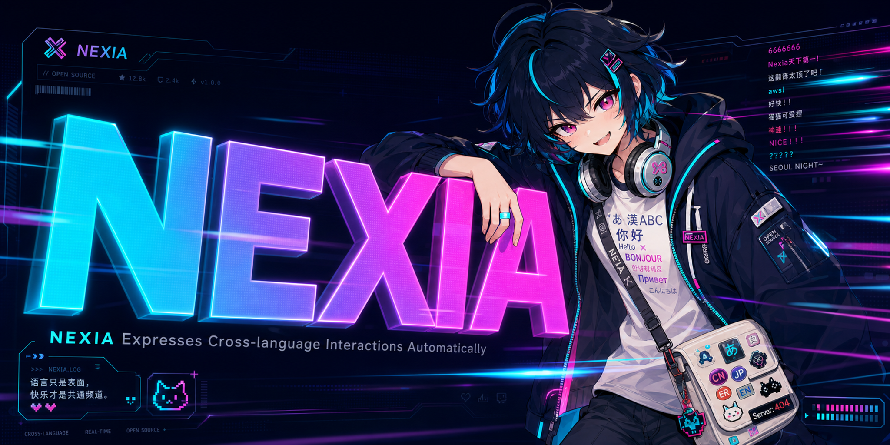
  </picture>
</p>

<p align="center">
  <strong>NEXIA = <u>N</u>EXIA <u>E</u>xpresses Cross-language Interactions <u>A</u>utomatically</strong>
  <br>
  <sub>🔀 跨服开黑，语言不通？奈奈帮你翻译翻译。</sub>
</p>

<p align="center">
  
  
  
  
</p>

---

## 👋 你好，我是奈奈

<table>
<tr>
<td width="70%">

**Nexia（奈克希亚）** 是一款英雄联盟游戏内 **实时聊天翻译 + 弹幕叠加** 桌面工具。

在韩服被队友用韩语指挥却一脸懵？在日服想跟队友配合但只能打英文？**Nexia 捕获游戏聊天框内容 → 即时翻译 → 以彩色弹幕形式飘过屏幕**，让你不用切出去查翻译，专注于赢下这局。

至于名字？**奈克希亚**是我的陪玩 ID，老客户都叫我 **奈奈** —— 你也能这么叫。

> *"语言不通就开喷是这个世界上最亏的事情——明明可以一起赢的。"*

</td>
<td width="30%" align="center">
  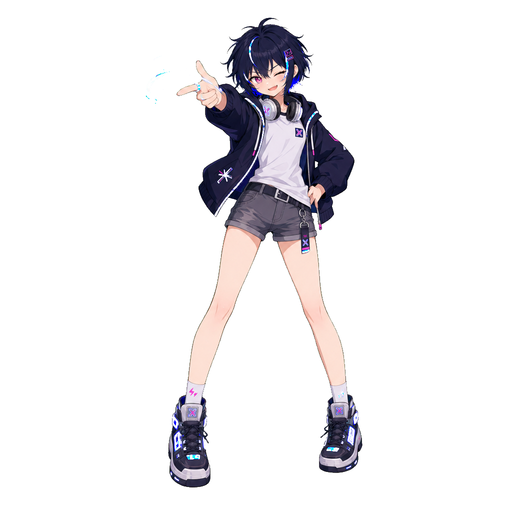
  <br>
  <sub>🎮 叫我奈奈就好～</sub>
</td>
</tr>
</table>

---

## ✨ 核心功能

<table>
<tr>
<td width="50%">
  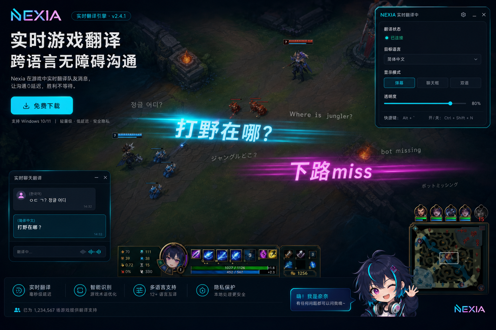
  <p align="center"><b>🎯 实时翻译弹幕叠加</b><br>聊天框消息 → 即时翻译 → 弹幕划过屏幕</p>
</td>
<td width="50%">
  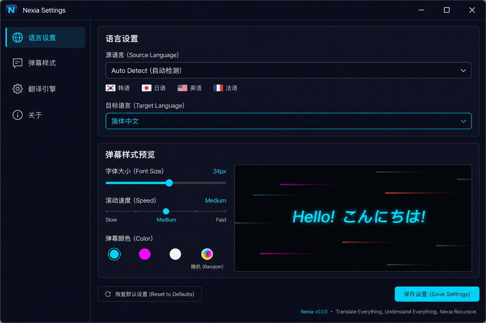
  <p align="center"><b>⚙️ 灵活配置</b><br>源语言 / 目标语言 / 弹幕样式 / 翻译引擎随心调</p>
</td>
</tr>
</table>

| 功能 | 说明 |
|---|---|
| 🌐 **多语言实时翻译** | 支持韩语、日语、英语、法语等 → 简体中文，翻译速度快到几乎零延迟 |
| 📺 **弹幕叠加显示** | 翻译结果以炫酷弹幕飘过屏幕，不遮挡核心游戏区域 |
| 🎨 **弹幕样式自定义** | 字体大小、飘过速度、颜色（青/品红/白/随机）随心调 |
| 🔌 **轻量不卡顿** | 基于 Tauri 2.0 + Rust，内存占用极低，绝不拖累你的 FPS |
| 🖥️ **跨平台** | Windows / macOS / Linux 全支持 |
| 🎮 **LoL 优先，可扩展** | 首发英雄联盟极致体验，架构预留扩展到其他游戏 |

---

## 🎭 奈奈的表情包

<p align="center">
  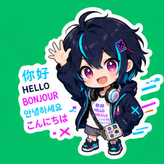
  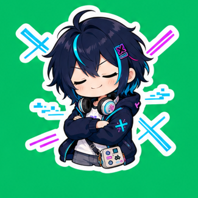
  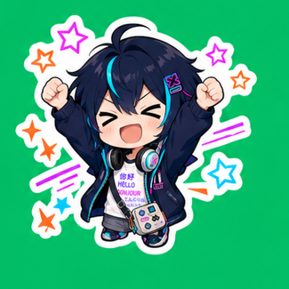
  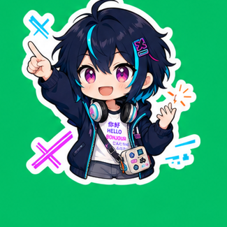
  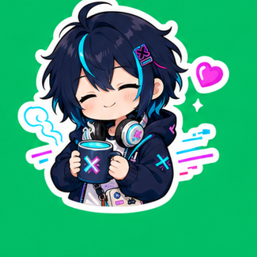
</p>

<details>
<summary>📦 全部 9 个表情（点击展开）</summary>
<p align="center">
   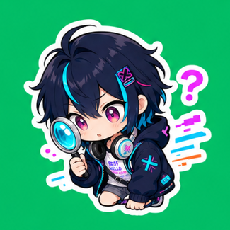 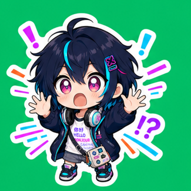<br>
  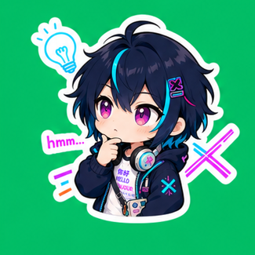  <br>
  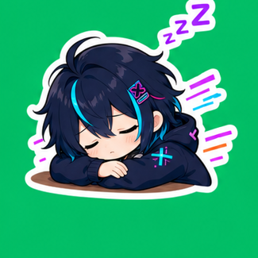  
</p>
</details>

---

## 🛠️ 技术栈

| 层 | 技术 |
|---|---|
| 🖥️ 桌面框架 | [Tauri 2.0](https://tauri.app) |
| ⚙️ 后端 | Rust |
| 🎨 前端 | React + TypeScript |
| 🌐 翻译引擎 | (待定) |
| 🎬 弹幕渲染 | Canvas / WebGL 叠加层 |

---

## 🚀 快速开始（开发中）

```bash
# 克隆仓库
git clone https://github.com/your-username/nexia.git
cd nexia

# 安装依赖
pnpm install

# 启动开发模式
cargo tauri dev
```

> ⚠️ Nexia 目前处于早期开发阶段，尚未发布可用版本。欢迎 ⭐ Star + 👀 Watch 关注进展！

---

## 🐱 关于奈奈的工作室

<p align="center">
  
</p>

> NEXIA Expresses Cross-language Interactions Automatically

---

<p align="center">
  <sub>Made with 💚 by Nexia's dev team · Mascot designed via <a href="https://github.com/anthropics/claude-code">Claude Code</a> + RepoChan</sub>
  <br>
</p>
